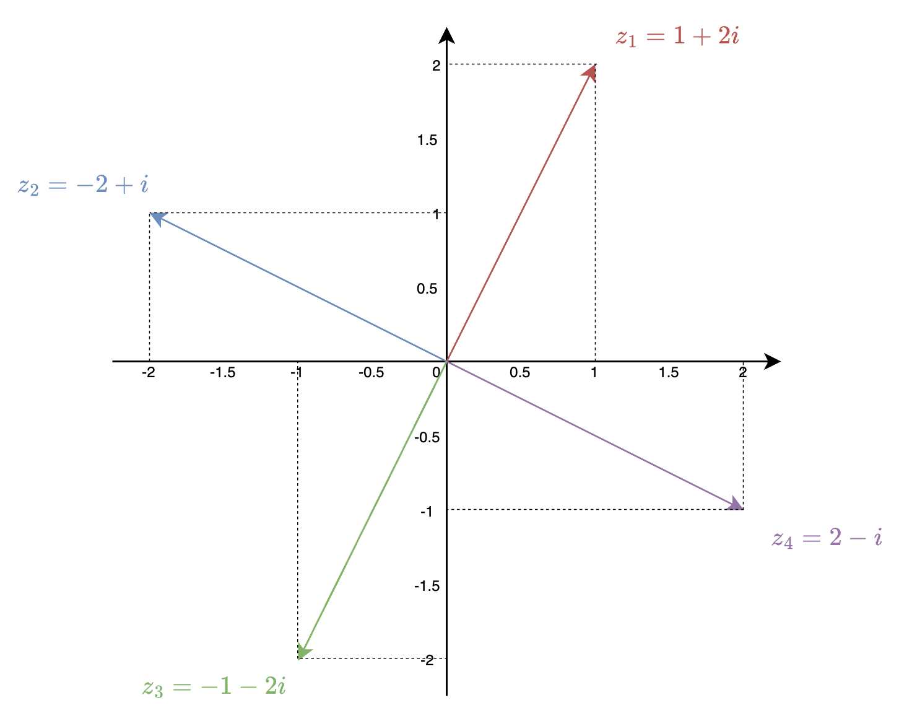

最近闲着没事干，就在实践怎么从零开始训练一个大模型。因为是参考Llama的训练的方法，不可避免会用到 RoPE，之前也确实对 RoPE 的原理一知半解。于是，决定狠下心来花点时间搞懂 RoPE。也刚好看到苏剑林苏神在知乎的[回答](https://www.zhihu.com/question/572726624)，感到非常惭愧，之前确实存在太多 “自欺” 行为了。


RoPE 是苏剑林等人在 [RoFormer: Enhanced Transformer with Rotary Position Embedding（2021）](https://arxiv.org/abs/2104.09864) 这篇文章中提出的 **一种（相对）位置编码方法**，用于解决 Transformer 模型在处理序列数据时的位置信息丢失问题。

与之前常见的**绝对位置编码**（Absolute Positional Encoding, APE）或 T5 等模型中使用的相对位置偏置（Relative Positional Bias）不同，**RoPE 的核心思想是通过对查询（Query, Q）和键（Key, K）向量应用旋转操作来编码绝对位置，从而使得它们的内积（点积）结果自然地蕴含了相对位置信息**。


 
 
 

# 前置知识
为了帮助理解 RoPE，我们需要先了解一些前置知识。比如高中时期学到的 **复数**.

让我们来唤醒远古的记忆，回忆一下什么是复数？例如，在下面的方程中:

$$ x^2 +1 = 0 \tag{1}$$

通过解这个方程，得到如下结果:

$$ x = \pm\sqrt{-1} $$

很显然，这个方程是没有实数解的，根号里面怎么能有负数呢？为了解决这个问题，数学家们引入了 **虚数** 的概念。按照上面的方程说，也就是假设存在一个 $i$, 使得 $i^2 = -1$, 那么之前式子（1）中的方程就可以写成:

$$ x^2 = i^2 \tag{2}$$

那么方程（2）的解就可以写成:
$$ x = \pm i $$

这里的 $i$ 就被称为 **虚数单位**。

 
 

## 什么是复数?

### 复数的定义

在数学中，复数是由 **实部** 和 **虚部** 组成的数。复数可以用 $a + bi$ 的形式表示，其中 $a$ 是实部，$b$ 是虚部，$i$ 是虚数单位。
其中，实部是由实数组成（正数，负数，0），虚部是由实数和虚数的乘积组成（比如，$2i$, $-3i$ 这样的，当然也可以是 $0$ ）


>需要注意的是，复数是实数的拓展，也就是说实数是复数的子集。 所以， **复数同样适配于==交换律==和==结合律==**

 

### 复数的模

**为什么要讲复数的模呢**？因为在后续的推导中，我们会用到复数的模。


复数的模（也称为绝对值）是指复数在**直角坐标系**中的距离。复数的模可以用以下公式计算：
$$ |z| = \sqrt{a^2 + b^2} \tag{3}$$
其中，$z$ 是复数，$a$ 是实部，$b$ 是虚部。


例如，复数 $z = 3 + 4i$ 的模可以用以下公式计算：
$$ |z| = \sqrt{3^2 + 4^2} = \sqrt{9 + 16} = \sqrt{25} = 5 $$

 

### 共轭复数

**共轭复数**是指实部相同、虚部互为相反数的复数。


共轭复数是俩==复数相乘==的一种特殊情况，如下式中:

$$\begin{aligned}
(a+bi)(a-bi) & =a^2-b^2i \\
 & =a^2+b^2 \tag{4}
\end{aligned}$$

其中，$a-bi$ 称作是 $a+bi$ 的**共轭复数**，又称复共轭、复数共轭。
更一般的定义，$z=a+bi$ 的共轭复数用 $\overline{z}$ 或 $z^*$ 表示，其中:
$$z^* = a - bi \tag{5}$$

而
$$zz^* = (a+bi)(a-bi) = a^2+b^2 = |z|^2 \tag{6}$$


也就是说，一个复数乘以它的共轭复数，得到的结果是这个复数的**模的平方**。


 

### 复数的除法

>由于加减法和乘法比较简单，这里就不展开了。之前在[复数的定义](#复数的定义)中也讲到了复数是支持交换律和结合律的。


**复数的除法** 需要利用到 **共轭复数** 的性质, 即在分子和分母中同时乘以**分母的共轭复数**。


对于 $z_1 = a + bi$ 和 $z_2 = c + di$, 其中 $z_2 \neq 0$, 那么分母和分子同时乘以$z_2$ 的共轭复数 $z_2^*$，就可以得到如下结果:
$$\begin{aligned}
\frac{z_1}{z_2} & =\frac{z_1z_2^*}{z_2z_2^*} \\
 & =\frac{z_1z_2^*}{\left|z_2\right|^2} \\
 & =\frac{(a+bi)(c-di)}{c^2+d^2} \\
 & =\frac{(ac+bd)+(bc-ad)i}{c^2+d^2} \tag{7}
\end{aligned}$$

比如在下面例子中:
$$\begin{aligned}
\frac{4+3i}{3+4i} & = \frac{(4+3i)(3-4i)}{(3+4i)(3-4i)} \\
 &=\frac{(4+3i)(3-4i)}{3^2+4^2} \\
 &=\frac{(4*3 + 3*4) + (3*3 - 4*4)i}{3^2+4^2} \\
 &=\frac{24}{25} - \frac{7}{25}i
\end{aligned}$$

 

### 复数的逆
同样的，后续的推导中，我们也会用到**复数的逆**。那么，什么是逆呢？


不严谨地说，逆的作用是用于 "撤销" 或者说 "还原" 某种操作，这使得在数学中 "反向操作" 存在可能，比如说解方程, 或者是解矩阵。



**在数学定义中**，**逆**是指一个元素与其逆元通过特定运算结合后，得到该运算的单位元。
后面的内容中，统一 **逆** 即为 **逆元**.

**特别地，乘法运算的单位元为 $1$，加法运算的单位元为 $0$，矩阵的单位元为 $I$ (单位矩阵)**。


什么意思呢，举例子说，实数 $a \neq 0$ 的情况下，在**乘法运算**中:

$$a*a^{-1} = 1$$

其中， $a^{-1}$ 表示为 $a$ 的逆, $1$ 是乘法中的单位元。很显然，**在乘法中，$a^{-1}$ 即为 $a$ 的倒数**。

同理，在实数的**加法运算**中:

$$a + a^{-1} = 0$$

与乘法运算不同，加法运算的单位元为 $0$，**$a^{-1}$ 即为 $a$ 的相反数**。

 

前面我们提到了，复数其实是实数的拓展，所以，在复数的特定运算中，也存在**逆**的概念。

假设 复数 $z \neq 0$，**它的逆 $z^{-1}$ 同样为倒数**，即 $z^{-1} = \frac{1}{z}$, 利用**共轭复数**的性质进行求逆的推导，对 $z^{-1}$ 除以一个共轭复数 $z^*$, 有:

$$\begin{aligned}
\frac{z^{-1}}{z^*} &= \frac{z^{-1}z}{z^*z}\\ 
&= \frac{1}{z^*z} \\
&= \frac{1}{|z|^2} 
\end{aligned}$$

$$那么复数z的逆为 \Rightarrow z^{-1} = \frac{z^*}{|z|^2} \tag{8}$$

 
 

## 复数与二维平面旋转

这是理解 RoPE 的关键。


前面讲了一大堆后，终于到了理解 RoPE 最关键的部分了。首先，对于一个实数而言，它的相反数在几何上代表的是什么呢？很简单，我们可以把它想象成一条直线，它的**相反数** 就是这条直线的**旋转了$180^{\circ}$**。

例如说，$2$ 逆时针旋转 $180^{\circ}$ 后变成 $-2$，如下图所示:

根据复数的定义中，$i^2 = -1$，那么我们可以把 $n$ 的相反数 $-n$ 写成:
$$ -n = i^2n \tag{9}$$

也就是说，$n$ 通过乘以 $i^2$ 绕原点旋转了 $180^{\circ}$，我们把 $i^2$ 当作乘了 2 次 $i$，故乘以 $i$ 相当于绕原点旋转了 $90^{\circ}$。

在接下来的小节中，通过图形化的方法，直观地理解为什么乘以 $i$ 是旋转 $90^{\circ}$。

 

### 复平面


**复平面** 是数学中用于几何表示**复数的二维坐标平面**，由水平的**实轴**（对应复数的实部）和垂直的**虚轴**（对应复数的虚部）构成。每个复数 $z = x + iy$ 可表示为复平面上的一个点 $(x, y)$ 或向量，其中 $x$ 为实部沿实轴方向，$y$ 为虚部沿虚轴方向。

这一概念可视为**笛卡儿平面**（其实就是直角坐标系）的扩展，但赋予了特定的代数结构（如复数的加法和乘法）。

复平面也被称为**高斯平面**，因其几何直观性成为研究复变函数、复分析及复几何的基础工具。此外，通过添加无穷远点 $\infty$，复平面可扩展为“**扩充复平面**”。


下面通过复平面来观察 $90^{\circ}$ 旋转的效果，在这个复平面中，画出了4个复数：
$$\begin{align*}
z_1 = 1 + 2i\\
z_2 = -2 + i\\
z_3 = -1 - 2i\\
z_4 = 2 - i\\
\end{align*}$$

<!--  -->

在上图中，$z_1$ 乘以 $i$ 得到 $z_2$，等价于 $z_1$ 逆时针旋转 $90^{\circ}$ 变成 $z_2$，同理 $z_1$ 乘以 $-i$ 则得到 $z_4$，等价于 $z_1$ 顺时针旋转 $90^{\circ}$ 变成 $z_4$，其他复数旋转同理。


很显然，在上图的复平面中可以发现，**复数是可以表示旋转的**


 

### 极坐标表示


在极坐标中，通过 **极径（距离）和 极角（角度）** 来确定平面上点的位置，与直角坐标系（笛卡尔坐标）的横纵坐标定位方式不同。

在极坐标中，任意点的表示为: $(r, \theta)$，例如 $(2, \frac{\pi}{3})$ 表示距离极点2单位、与极轴夹角$60^{\circ}$的点。

**与直角坐标系的相互转换**:

- 直角坐标转极坐标: $r = \sqrt{x^2 + y^2}$, $~\theta = arctan(\frac{y}{x})$
- 极坐标转直角坐标: $x = rcos\theta$, $~y = rsin\theta$

由此可知，在极坐标中，模就是 $r$


既然在复平面中，通过乘以 $i$ 就可以旋转 $90^{\circ}$，很自然地我们就会去想，如果我想要**旋转任意角度**，那又该怎么表示呢？
还有，为什么乘以 $i$ 就可以旋转 $90^{\circ}$，单单从图上看非常容易理解，但背后的原因是什么？

为了解决这两个疑问，这里引入复平面上的 **极坐标表示**，其中横坐标表示的是复数的实部，纵坐标表示的是复数的虚部。
<!--  -->

在上图中，复数 $z = a+bi$ 可以通过 $(r, \theta)$ 来确定极坐标，其中 $r = |z|$ 即复数的模，而 $\theta$ 表示的是实数轴和复数所表示的向量夹角。

参考实数极坐标转直角坐标，我们可以将实部 $a$ 和 虚部 $b$ 分别表示为:
$$a = rcos\theta \\
b = rsin\theta
$$

通过极坐标转直接坐标，我们得到如下式子:
$$
\begin{aligned}
z & = a + bi \\
 & = rcos\theta + irsin\theta \\
 & = r(cos\theta+isin\theta) \tag{11}
\end{aligned}
$$

根据欧拉公式 $e^{i\theta} = cos\theta + isin\theta$，上面的公式（11）可以写成:
$$z = re^{i\theta} \tag{12}$$
>欧拉公式推导见 [附录 证明1](#证明1-欧拉公式推导)

此时，给定任意两个用**极坐标**表示的复数：$z_1 = r_1e^{i\theta_1}$ 和 $z_2 = r_2e^{i\theta_2}$。

将 $z_1$ 与 $z_2$ 相乘，我们可以得到如下式子:
$$
\begin{aligned}
z_1 z_2 &= r_1 r_2 e^{i\theta_1}e^{i\theta_2} \\
 &= r_1 r_2 e^{i(\theta_1+\theta_2)} \\
\tag{13}
\end{aligned}$$

其中，式子（13）的模 $|z_1 z_2| = r_1r_2$，而式子（13）与实数轴的向量夹角为 $\theta_1+\theta_2$。   

由此我们知道一件事，两个复数相乘后，在复平面上会带来2种几何变化：
1. 长度的缩放（通过改变模长）
2. 旋转（通过改变夹角）

 

### 旋转子

在上小节中，我们知道了两个复数相乘后，会使得复数向量发生**长度缩放**和**旋转**。回到之前提到的问题，如果我只想旋转任意角度，而不改变程度，那该怎么办呢？

根据之前式子（13）可以知道，假如 $z_2$ 中的 $r_2$ 为1，也就是 $z_2=e^{i\theta_2}$，那么此时 $z_1$ 与 $z_2$ 相乘后，会使得 $z_1$ 旋转 $\theta_2$ 角度，而不会改变长度。

这样的复数就称为**旋转子**（$e^{i\theta}$），旋转子就实现了只旋转，而不改变长度的效果，并且可以将**复数**旋转任意角度。一般地，将复数旋转角度 $\theta$ 的旋转子定义为:
$$R_{\theta} = cos\theta+ isin\theta = e^{i\theta} \tag{14}$$

例如，对于复数 $z = 2+2i$，假如对其逆时针旋转 $45^\circ$，也就是旋转子为:

$$
\begin{aligned}
 R_{45^\circ} = 1·e^{i·45^\circ} &= cos45^\circ + isin45^\circ\\
 &=\frac{\sqrt{2}}{2} + \frac{\sqrt{2}}{2}i \\
 &\approx 0.71 + 0.71i
\end{aligned}
$$

那么 $z$ 逆时针旋转 $45^\circ$后:
$$
\begin{aligned}
 z·R_{45^\circ} &= (2+2i)(\frac{\sqrt{2}}{2} + \frac{\sqrt{2}}{2}i)\\
 &=\sqrt{2} + \sqrt{2}i + \sqrt{2}i + \sqrt{2}i^2 \\
 &=2\sqrt{2}i \\
 &\approx 2.83i
\end{aligned}
$$

在下图中，我们可以直观地看到逆时针旋转 $45^\circ$ 的效果：

接下来我们再考虑下 **顺时针** 旋转的情形，很自然的，根据式子（14），顺时针旋转的旋转子可以表示为：

$$
\begin{aligned}
 R_{-\theta} &= cos(-\theta)+ isin(-\theta) \\
 &= cos\theta - isin\theta \\
 &= e^{-i\theta} \tag{15}\\
\end{aligned}
$$

此时，我们不难发现在式子（15）的中间过程 $cos\theta - isin\theta$ 不就是 $cos\theta+ isin\theta = e^{i\theta}$ 的共轭复数吗？那么显然 $(R_{\theta})^* = e^{-i\theta}$

于是，我们可以把 $R_\theta$ 的共轭复数 $(R_\theta)^*$ 表示为:
$$
\begin{aligned}
 (R_{\theta})^* &= e^{-i\theta} \\
 &= R_{-\theta} \tag{16}\\
\end{aligned}$$

$$\Rightarrow (R_{\theta})^* = R_{-\theta}$$

 

既然说到旋转子与其共轭复数的关系，那么肯定也要考虑下，旋转子与其**逆**的关系呢？

在前面的小节中，提到了复数的逆（公式8）可以表示为:
$$z^{-1} = \frac{z^*}{|z|^2}$$

又因为，在极坐标中，$|z|^2 = r$ ，且旋转子的模为 $1$，那么旋转子的逆 $(R_\theta)^{-1}$ 可以表示为:
$$
\begin{aligned}
 (R_\theta)^{-1} &=\frac{(R_\theta)^*}{r} \\
 &= (R_\theta)^* \\
 \tag{17}\\
\end{aligned}$$

$$\Rightarrow (R_\theta)^{-1} = e^{-i\theta}$$



**结论**:
- 旋转子 $R_\theta$ 表示为: $R_\theta = e^{i\theta}$，表示逆时针旋转
- 旋转子的共轭复数 $(R_\theta)^*$ 表示为: $(R_\theta)^* = e^{-i\theta}$，表示顺时针旋转
- 旋转子的逆 $(R_\theta)^{-1}$ 等价于旋转子的共轭复数 $(R_\theta)^*$

到这里也体现了 **逆** 的作用就是 "撤销" 或者说 "还原" 某种操作。比如在复数旋转的例子中，旋转的逆就可以 "抵消" 旋转。


到此已经铺垫完了 **复数与二维平面旋转** 的前置知识了。

 
 

## 旋转矩阵

接下来我们再补充一个概念——**旋转矩阵**。


在线性代数中， **旋转矩阵** 就是一种在欧式空间中执行旋转的变换矩阵。（**本质上是基的坐标变换**）

详细可看 [wiki上的旋转矩阵概念](https://en.wikipedia.org/wiki/Rotation_matrix#Properties)


例如，对于一个二维向量 $v = (x, y)$，我们可以将其绕笛卡尔坐标系（即直角坐标系）的原点逆时针旋转 $\theta$ 角度，具体可以用以下矩阵乘法来表示:
$$
R · v = \begin{bmatrix}
cos\theta & -sin\theta \\
sin\theta & cos\theta
\end{bmatrix}
\begin{bmatrix}
x \\
y
\end{bmatrix}
= \begin{bmatrix}
xcos\theta - ysin\theta \\
xsin\theta + ycos\theta
\end{bmatrix}
\tag{18}
$$

在公式（18）中，$R$ 即为旋转矩阵，而 $v$ 即为待旋转的向量（基）。需要注意的是这里的 $v$ 需要写成列向量的形式，并且左乘 $R$ 表示的才是坐标变换（在这里即旋转），右乘是基变换。关于 $R$ 是怎么推导证明为旋转矩阵的可以看 [附录中的证明2](#证明2-旋转矩阵推导证明)

>注意：在旋转矩阵中有几个很好的性质，$R^T$ = $R^{-1}$ 且行列式 $det(R)=1$
>
> 证明起来也非常简单，因为 $R^TR=I$，所以 $R$ 为正交矩阵，故 $R^T$ = $R^{-1}$

到此，也介绍完了 **旋转矩阵** 的概念。

 
 
 

# RoPE

在前面的章节中，我们通过介绍复平面相关的知识看到了一个非常绝妙的思想：**用旋转的角度来表示绝对位置，而向量之间的点积（或者说相似度）就自然和它们的绝对位置相关**。

这是一个完美的二维解决方案，但我们知道，在 Transformer 模型里，像 Llama 这样的模型，它的词向量、Query 向量和 Key 向量的维度（$d_{model}$）可能高达 4096 甚至更高。那么，问题来了：**我们如何将这个优雅的二维旋转，应用到这个几千维的高维空间上呢？**

 
 

## 从二维到高维

这里要讲清楚 RoPE 是如何巧妙地解决这个升维问题的。

 

### 核心思想：分而治之

RoPE 的做法非常聪明，它没有去定义一个复杂的、难以想象的4096维旋转。恰恰相反，它把高维问题分解成了我们刚刚已经理解的二维问题。

具体来说，它将一个 $d$ 维的向量，**两两一组进行配对**。比如，一个 $d$ 维的向量 $x$:
$$
\begin{aligned}
x &= [x_1, x_2, x_3, \ldots, x_{d-1}, x_d] \\
\end{aligned}
$$

RoPE 会把它看作是 $\frac{d}{2}$ 个独立的二维向量:
$$
\begin{aligned}
    [x_1, x_2], [x_3, x_4], \ldots, [x_{d-1}, x_d] \\
\end{aligned}
$$

然后，**对每一对二维向量，都应用我们刚才讲过的二维旋转!**

 

### 引入多频率旋转：捕捉不同尺度的位置关系

现在又有一个新问题：难道我们对这 $\frac{d}{2}$ 对二维向量都应用相同的旋转角度吗？如果那样做，信息就太单一了。个小组都用完全相同的旋转角度 $m_{\theta}$ 吗？如果那样做，信息就太单一了。RoPE 的另一个精妙之处在于，它为每一组分配了不同频率的旋转。想象一下，我们有很多块不同转速的钟表，每一块表都用来记录位置信息。

1. **高频部分（转得快的表）**：对应向量的==前几个==维度对。它们的旋转角度变化很快。这使得模型能非常精确地感知到近距离的词之间的相对位置关系。比如，m=1 和 m=2 在高频部分会有很大的角度差异。
2. **低频部分（转得慢的表）**：对应向量的==后几个==维度对。它们的旋转角度变化很慢。这使得模型能够感知到远距离的、更宏观的相对位置关系。比如，m=1 和 m=50 在低频部分才开始有显著的角度差异。


这种多频率的设计，让模型同时拥有了“显微镜”和“望远镜”的能力，可以捕捉从词到词，再到段落级别的多尺度相对位置信息。


 

### 数学公示的呈现

这个不同频率的旋转，是通过一个固定的公式来定义的。对于第 $i$ 个二维向量组（$i$ 从 $0$ 到 $\frac{d}{2}-1$），其旋转角度 $m_{\theta}$ 为:速度 $θ_i$ 被设定为：

$$
\begin{aligned}
    \theta_i = base^{-\frac{2i}{d}} \tag{19}
\end{aligned}
$$

这里的 $base$ 通常是一个大数，比如 10000。你可以看到，随着 $i$ 的增大（即向量维度越靠后），$\theta_i$ 会变得越来越小，旋转也就越来越慢。所以，对于整个 $d$ 维向量 $x$ 和位置 $m$，RoPE 的完整操作可以写成一个矩阵形式，但本质上就是对每个 $[x_{2i}, x_{2i+1}]$ 进行独立的二维旋转：
$$\begin{pmatrix}
x_{2i}^{\prime} \\
x_{2i+1}^{\prime}
\end{pmatrix}=
\begin{pmatrix}
\cos(m\theta_i) & -\sin(m\theta_i) \\
\sin(m\theta_i) & \cos(m\theta_i)
\end{pmatrix}
\begin{pmatrix}
x_{2i} \\
x_{2i+1} \tag{20}
\end{pmatrix}$$

 
 

## RoPE 的位置在 Transformer 中的使用

我们已经知道了 RoPE 的完整数学原理。那么，在 Transformer 的自注意力机制中，它到底作用在哪个环节呢？回忆一下自注意力机制，我们有三个关键的向量：$Query (Q)$, $Key (K)$, 和 $Value (V)$。

1. **注意力得分的计算**：$score = Q * K^T$。这个得分决定了==一个词应该对另一个词投入多少注意力（也就说它们之间是否有关系）==。这正是位置信息应该发挥作用的地方！
2. **信息的聚合**：$Attention = softmax(score) * V$。$Value$ 向量代表了==这个词本身携带的内容信息==。

因此，RoPE 的应用方式是：

- **只对 $Q$ 和 $K$ 向量应用旋转变换**
- **不对 $V$ 向量做任何操作**

为什么呢？因为我们需要 $Q$ 在位置 $m$ 和 $K$ 在位置 $n$ 的交互（即点积）能够感知到它们的相对位置 $m-n$。而 $V$ 向量只是被注意力权重加权求和的内容载体（可以把它想象成就是你原本就要找的信息），它的内容本身不应该被位置信息 "**扭曲**"。所以，注意力分数的计算就变成了：

$$
\begin{aligned}
    score_{m,n} = (R_mq_m)^T * (R_nk_n) = q_m^T * R_{n-m} * k_n \tag{21}
\end{aligned}
$$

最终得到的注意力分数，完美地包含了 $q_m$ 和 $k_n$ 的内容信息，以及它们之间相对位置 n-m 的几何关系。


**可能有人会困惑的点**：

在式子（21）中用 $q$ 转置 乘以 $k$，是因为 $q$ 和 $k$ 都是列向量，而 $score$ 是一个标量，所以需要转置。在数学和计算机科学中，向量通常默认是 **列向量**。


 
 
 

# 参考文献
1. [复数旋转与二维空间旋转](https://www.cnblogs.com/noluye/p/11964513.html)
2. [RoFormer: Enhanced Transformer with Rotary Position Embedding（2021）](https://arxiv.org/abs/2104.09864)

# 附录
## 证明1 欧拉公式推导

欧拉公式是一个非常重要的数学公式，它是由瑞士数学家莱昂哈德·欧拉（Leonhard Euler）于1737年提出的。欧拉公式描述了 **复数的指数形式** 和 **三角函数** 之间的关系。


欧拉公式的形式为:
$$e^{i\theta} = cos\theta + isin\theta$$

根据 $e^x$, $sinx$ 和 $cosx$ 的泰勒级数展开，我们可以将 $e^{i\theta}$, $cos\theta$ 和 $sin\theta$ 分别表示为:

$$e^{i\theta}=1+(i\theta)+\frac{(i\theta)^2}{2!}+\frac{(i\theta)^3}{3!}+\ldots\tag{1}$$

$$cos\theta=1-\frac{\theta^{2}}{2!}+\frac{\theta^{4}}{4!}-\frac{\theta^{6}}{6!}+\ldots \tag{2}$$

$$sin\theta=1-\frac{\theta^3}{3!}+\frac{\theta^5}{5!}-\frac{\theta^7}{7!}+\ldots \tag{3}$$

又因为复数的定义 $i^2 = -1$，式（1）可写成:
$$\begin{aligned}
e^{i\theta} & =1+i\theta-\frac{\theta^2}{2!}-i\frac{\theta^3}{3!}+\frac{\theta^4}{4!}+i\frac{\theta^5}{5!}-\frac{\theta^6}{6!}-i\frac{\theta^7}{7!}+\ldots \\
 & =(1-\frac{\theta^2}{2!}+\frac{\theta^4}{4!}-\frac{\theta^6}{6!}+\ldots)+i(\theta-\frac{\theta^3}{3!}+\frac{\theta^5}{5!}-\frac{\theta^7}{7!}+\ldots) \\
 & =cos\theta+isin\theta \tag{4}
\end{aligned}$$
证明完毕。

 
 

## 证明2 旋转矩阵推导证明
假设点 $P(x, y)$ 到原点的距离为 $r$，点 $P$ 与 $x$ 轴的夹角为 $\phi$，其极坐标为:
$$x = rcos\phi, ~y = rsin\phi \tag{1}$$

旋转 $\theta$ 角度后，新点 $P'(x', y')$ 的极坐标为$(r, \phi + \theta)$，然后转为直角坐标:
$$ x' = rcos(\phi + \theta), ~y'=rsin(\phi+\theta) \tag{2}$$

通过三角函数的相关性质，我们可以将公式（2）展开为:
$$
\begin{aligned}
x' &= rcos\phi·cos\theta - rsin\phi·sin\theta \\
y' &= rsin\phi·cos\theta + rcos\phi·sin\theta \\
\tag{3}
\end{aligned}
$$

根据公式（1），我们可以将公式（3）进一步化简为：
$$
\begin{aligned}
x' &= xcos\theta - ysin\theta \\
y' &= xsin\theta + ycos\theta \\
\tag{4}
\end{aligned}
$$
因式分解公式（4）：
$$
\begin{aligned}
\begin{bmatrix}
x' \\
y'
\end{bmatrix}
 &= \begin{bmatrix}
cos\theta & -sin\theta \\
sin\theta & cos\theta
\end{bmatrix}
\begin{bmatrix}
x \\
y
\end{bmatrix} \\
 &= R·v \\
\tag{5}
\end{aligned}
$$

其中，$R$ 即为旋转矩阵，$v$ 即为待旋转的向量。

证明完毕。